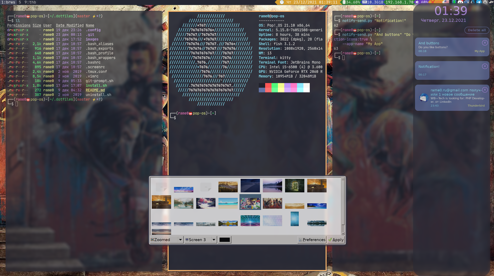

# My dotfiles

<!--ts-->
* [Screenshots](#screenshots)
* [Install](#install)
* [Uninstall](#uninstall)
<!--te-->

## Screenshots



## Install
### Download and change folder
```
cd ~
git clone https://github.com/rame0/dotfiles.git

cd dotfiles
```
### Run install
```
./install.sh
```

# Uninstall

__DO NOT USE YET__

### Change to dotfiles folder
```
cd ~/dotfiles
```

### Run uninstaller
```
./uninstall.sh
```
